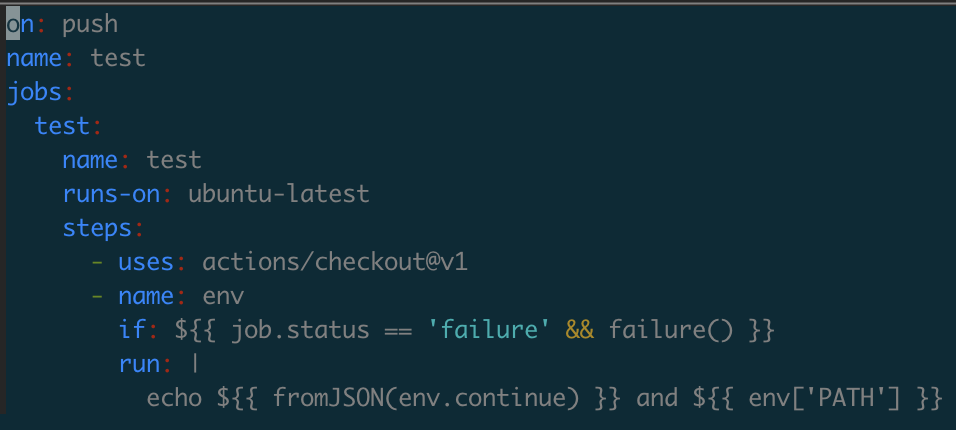
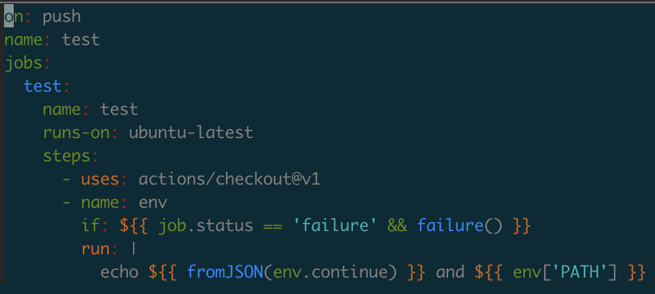

# github-actions-yaml.vim

Vim plugin for GitHub Actions (yaml file)

# Feature

- Syntax Highlight
- Completion of workflow keywords

## Highlighting Example

| before | after |
| --- | --- |
|  |  |

# Installation

## dein.vim

```vim
call dein#add('yasuhiroki/github-actions-yaml.vim')
```

## License

[MIT License](License.txt)
